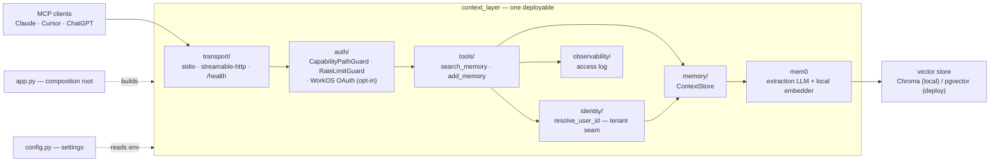

# Architecture

One deployable (a **modular monolith**), organized so each architecture layer
is its own package with a clean boundary — so any layer can be extracted into a
standalone service later without a rewrite.

## Request / data flow

## Layer → directory map

| Layer | Directory | Responsibility | If extracted, it becomes… |
|---|---|---|---|
| Composition root | `app.py`, `__main__.py` | Build the server, pick the transport, run | the service's `main()` |
| Transport | `transport/` | stdio / streamable-http assembly + `/health` | the network edge / API gateway |
| Auth | `auth/` | capability-path + rate-limit guards, WorkOS OAuth verifier | an auth/gateway service |
| Tools | `tools/` | the MCP tools (`search_memory`, `add_memory`) | the MCP-facing service |
| Identity | `identity/` | `resolve_user_id` — the single tenant-isolation seam | shared client of an auth service |
| Memory | `memory/` | `ContextStore` over mem0 (+ tenant guard) | the **memory service** |
| Ingest | `ingest/` | offline backfill: export parsers → normalized format → per-conversation scope inference → mem0 extraction | a batch import worker |
| Observability | `observability/` | structured access/audit logging | ships to a log/metrics sink |
| Config | `config.py` | env-driven settings + mem0 config builder | 12-factor env per service |

`ingest/` is the one package deliberately *outside* the request-flow diagram
above: it's an offline batch layer that seeds the store from existing history
(Claude/ChatGPT exports, uploaded artifacts), not a step in the live MCP request
path. It targets a shared normalized conversation format so downstream backfill
code is written once, not once per source.

## Deploy notes

- Entrypoint: `python -m context_layer` (or the `context-layer` console script) → `app.run()`.
- `MCP_TRANSPORT` selects stdio (local) vs streamable-http (deploy); `config.workos_enabled()` selects capability-path vs OAuth auth.
- `GET /health` (and `/healthz`) returns 200 without auth — for liveness/readiness probes.
- The one genuinely separate service today is the **vector store** (pgvector on deploy); everything else is in-process libraries with clean seams for later extraction.
