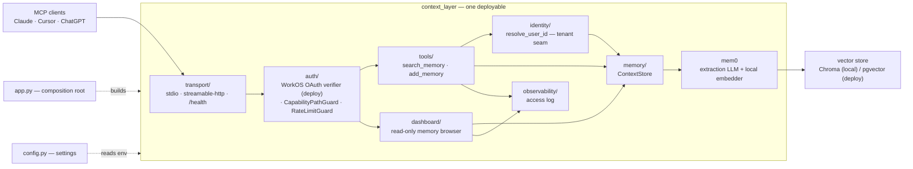

# Architecture

One deployable (a **modular monolith**), organized so each architecture layer
is its own package with a clean boundary — so any layer can be extracted into a
standalone service later without a rewrite.

## Request / data flow

## Layer → directory map

| Layer | Directory | Responsibility | If extracted, it becomes… |
|---|---|---|---|
| Composition root | `app.py`, `__main__.py` | Build the server, pick the transport, run | the service's `main()` |
| Transport | `transport/` | stdio / streamable-http assembly + `/health` | the network edge / API gateway |
| Auth | `auth/` | WorkOS OAuth token verifier, capability-path + rate-limit guards | an auth/gateway service |
| Tools | `tools/` | the MCP tools (`search_memory`, `add_memory`) | the MCP-facing service |
| Identity | `identity/` | `resolve_user_id` — the single tenant-isolation seam | shared client of an auth service |
| Memory | `memory/` | `ContextStore` over mem0: `add`/`search`/`all`/`delete`/`delete_all`, each behind the tenant guard | the **memory service** |
| Dashboard | `dashboard/` | the read-only memory browser at `/dashboard`: AuthKit browser sign-in under OAuth, the token path under capability mode | the web frontend |
| Ingest | `ingest/` | offline backfill: export parsers → normalized format → mem0 extraction | a batch import worker |
| Observability | `observability/` | one line of JSON per tool call: tool, tenant, client, timestamp | ships to a log/metrics sink |
| Config | `config.py` | env-driven settings + mem0 config builder | 12-factor env per service |

`ingest/` is the one package deliberately *outside* the request-flow diagram
above: it's an offline batch layer that seeds the store from existing history
(Claude/ChatGPT exports, uploaded artifacts), not a step in the live MCP request
path. It targets a shared normalized conversation format so downstream backfill
code is written once, not once per source.

Tests mirror the layers one-for-one (`tests/<layer>/test_*.py`), so a package and its tests move together if it is ever extracted. `scripts/` holds the out-of-band entrypoints that reach these layers without going through MCP: `smoke_test.py` and `inspect_db.py` against the memory layer, `backfill.py` against ingest, `verify_oauth.py` against a deployed instance's OAuth wiring.

## Auth modes

The HTTP transport has two mutually exclusive auth modes, chosen at composition time by `config.workos_enabled()` — true only when all three of `WORKOS_CLIENT_ID`, `WORKOS_AUTHKIT_DOMAIN`, and `PUBLIC_SERVER_URL` are set. The deployed instance runs the OAuth mode; a partial config falls back to capability paths, silently.

| | OAuth (deploy) | Capability path (fallback) |
|---|---|---|
| Guard installed | `RateLimitGuard` only — FastMCP owns auth | `CapabilityPathGuard` (+ the same rate limit) |
| Endpoint | `/mcp`, plus the `/.well-known/*` discovery routes and `/dashboard` | `/<token>/mcp` and `/<token>/dashboard`; everything else 404s |
| Unauthenticated request | 401 + `WWW-Authenticate` with a `resource_metadata` hint, which is what makes a connector start sign-in | 404, never 401 — a 401 would launch a sign-in flow that cannot succeed |
| Credential | WorkOS-issued bearer token, verified against the tenant JWKS | the URL itself |
| What it identifies | the person — every client they sign in from shares one namespace | the client — every client shares one namespace |
| `resolve_user_id` returns | `WORKOS_USER_ID_PREFIX` + the token subject | `DEFAULT_USER_ID` |

The middle row is the real change between the two, and it inverts what the server can tell apart. A capability token is issued per client and says nothing about who is holding it; a WorkOS token names a person and says nothing about which app they came from. So under OAuth, Claude, Cursor, and ChatGPT converge on one set of memories — the point of the product — while the auth layer keeps no per-client identity at all, which is why the access log has to fall back to `User-Agent` and revocation lives at WorkOS rather than here.

They can't stack: the capability guard would 404 the discovery routes and swallow the 401, so OAuth mode installs only the rate limiter.

The dashboard rides the same two modes but authenticates itself: FastMCP's bearer middleware only covers `/mcp`, so under OAuth `/dashboard` runs a WorkOS AuthKit browser sign-in of its own, keeping the session in a sealed, `/dashboard`-scoped, httponly cookie (needs `WORKOS_API_KEY` + `WORKOS_COOKIE_PASSWORD`, plus the callback URL registered at WorkOS). The signed-in WorkOS user id gets the same `WORKOS_USER_ID_PREFIX` a bearer token's subject gets, so the browser and the connectors resolve to the same namespace. Under capability paths there is no sign-in — reaching `/dashboard` through a token path is the credential, exactly as for `/mcp`.

The access log names the caller from whichever mode is active — the server-assigned token label under capability paths, the request's `User-Agent` under OAuth (self-asserted, so readable but never a basis for authorization). `client_id` comes from the verified token and reads `"unknown"` on WorkOS MCP-flow tokens, which carry neither `client_id` nor `azp`; recovering the real one needs introspection (PER-65).

## Deploy notes

- Entrypoint: `python -m context_layer` (or the `context-layer` console script) → `app.run()`.
- `MCP_TRANSPORT` selects stdio (local) vs streamable-http (deploy).
- `GET /health` (and `/healthz`) returns 200 without auth, ahead of both guards — for liveness/readiness probes.
- The one genuinely separate service today is the **vector store** (pgvector on deploy); everything else is in-process libraries with clean seams for later extraction.
